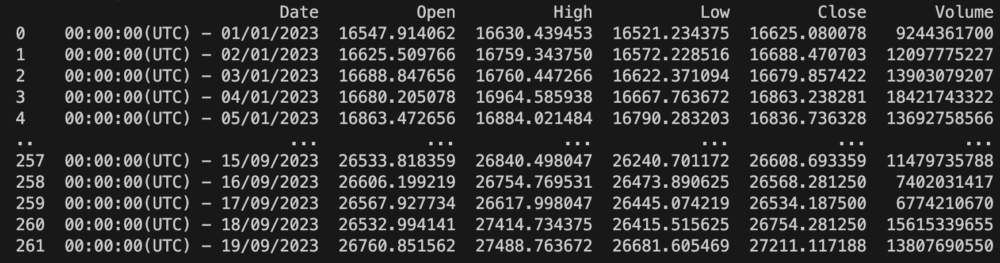
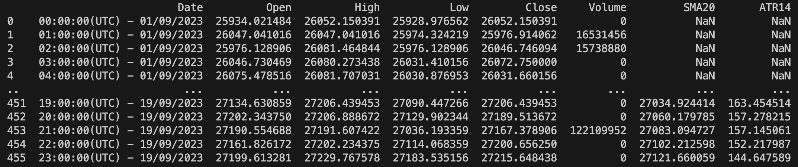
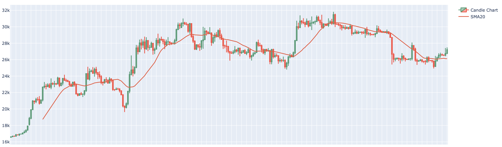

# Finance Analysis Tools


## Description
The tool created for basic financial analysis. And also help you trainning to apply your knowledge to realistic price pattern. 

This project is implemented base on these library: 
- yfinance (https://github.com/ranaroussi/yfinance)
- vnquant (https://github.com/phamdinhkhanh/vnquant)
- talib (https://github.com/TA-Lib/ta-lib-python)
- plotly (https://github.com/plotly/plotly.py)
- ...

## Installation
```bash
git clone https://github.com/LongSei/FinanceAnalysisTool
```

```bash
pip3 install -r requirements.txt
```

## Features
- Crawling Data
- Technical Analysis
- Plot The Graph
- Generate Pridicting Challenge 

<!-- #### On-chain Analysis
- Tracking crypto wallets (Updating...) -->

## Usage
:star: You can read the code comment to know exactly which is the input and output of functions

#### Crawling Data
:thought_balloon: import library first
``` python
from crawling.price import * 
```

:thought_balloon: Return the pandas DataFrame which contains information about your Cryptocurrency
``` python
data = DataCrypto('btc-usd').getHistoricalData(beginTime='01-01-2023', endTime='01-01-2023', interval='1d')
print(data)
```

:thought_balloon: Return pandas DataFrame which contains information about your Vietname Stock Market
``` python
data = DataStock('FPT').getHistoricalData(beginTime='01-01-2023', endTime='01-01-2023')
print(data)
```

``` python
data = DataStock('FPT').getBasicIndex(beginTime='01-01-2023', endTime='01-01-2023')
print(data)
```

#### Add indicator
:thought_balloon: import library first
``` python
from crawling.price import *
```


:thought_balloon: You need to add the data of your indicator before you can draw it
``` python
data = AddAttribute().TechnicalAnalysis().SMA(data, 20, 'Close', 'SMA20')
data = AddAttribute().VolatilityAnalysis().ATR(data, 14, ['High', 'Low', 'Close'], columnName='ATR14')
print(data)
```

#### Plot the graph
:thought_balloon: import library first
``` python
from utils.plot import * 
```

:thought_balloon: Add attribute for the graph before draw
```python
# Add attribute
plot.add_attribute(function=plot.candle_stick, row=1, name='Candle Chart')
plot.add_attribute(function=plot.SMA, row=1, name="SMA20")

# Draw the graph
plot.plotGraph(priceData=data)
```

##### Graph List
```
candle_stick         Candle Stick
```

##### Indicator List
```
SMA                  Simple Moving Average
RSI                  Relative Strength Index
BBANDS               Bollinger Bands      
```

#### Generate Pridicting Challenge 
```python
from tools.generateProblems import *
# tickers you want to generate problem
tickers = ['FPT', 'VNI']

# Initialize the size of problemDataSet and resultDataSet
problemLen = 100
resultLen = 20

gen = generateProblems(tickers=tickers)
gen.generate(problemLen=problemLen, resultLen=resultLen, typeFinanceProduct='stock')

# You can see the problem data in 'ProblemSet' folder
```